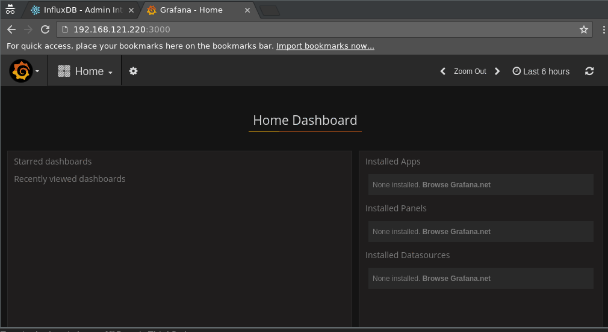

# stats-example-puppet

## Usage:

### Vagrant up
```
git clone https://github.com/dennisdegreef/stats-example-puppet.git
cd stats-example-puppet
vagrant up
vagrant provision
```

### Find out the IP address of the machine
```
vagrant ssh-config | grep HostName | awk '{print $2}'
```

## Configure a user for Grafana in InfluxDB


## Configure Grafana to connect to InfluxDB


## Create a new dashboard and first graph



